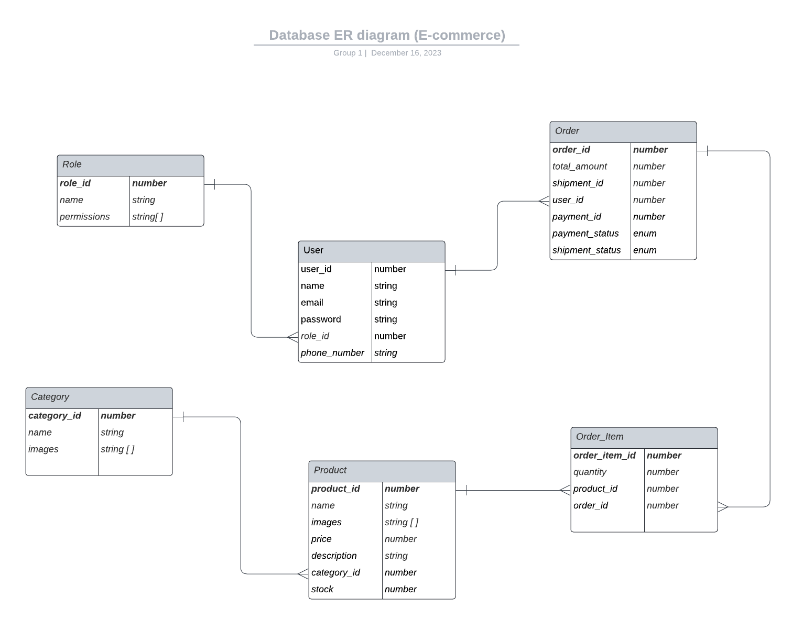

# Introduction

Back-end part of the e-commerce website selling tennis products. REST API is implemented according to the Entity-Relationship Diagram outlining the data model including the relationships and attributes of collections within the system.

## Contents

- [Technologies](#technologies)
- [Getting Started](#getting-started)
- [ER Diagram](#er-diagram)
- [Project Features](#project-features)
- [Project Structure](#project-structure)
- [Testing](#testing)
- [Deployment](#deployment)

## Technologies


## Getting started

- Clone the project `git clone https://github.com/sytnikov/fs16-backend-public.git`;
- Create your `.env` file using `.env.example` file as an exaple and fill it with your credentials;
- Use `npm install` to install all dependencies and necessary packages;
- Run the server using `npm run sever`.

## ER Diagram

Within the project, the following entities are covered: users, products, categories, orders, and roles.


## Project Features

### Entity CRUD Operations

Based on the specifications provided in the ERD assignment the basic CRUD (Create, Read, Update, Delete) operations for the entities are implemented.

### Authentication and authorization

For security resons, certain endpoint are protected with the following middleware:

- checkAuth: verifying is a user is logged in. There are two ways of authentication implemented: using JWT and brokered authentication with Google;
- checkRole: verifying if a user is a customer or and admin;
- checkPermissions: verifying if an admin has a particular access

### Response Format

All API responses are provided in JSON format which includes a `status`, `data`, and an optional `message` field.

### Error Handling

To handle API errors, the apiErrorHandler is implemented.

## Project Structure

Below is the high-level project folder structure represented.

```
 .
 ├── server
 |  ├── controllers
 |  ├── middlewares
 |  ├── models
 |  ├── routes
 |  ├── schemas
 |  ├── services
 |  ├── test
 |  ├── types
 |  ├── utils
 |  ├── app.ts
 |  ├── server.ts
 ├── .env.example
 ├── .gitignore
 ├── package.json
 ├── Database-ER-diagram.png
 ├── README.md
 ├── jest.config.ts
 └── tsconfig.json
```

## Testing

The test cases for all the key Services and Controllers have been built with Jest testing library. In this porject, unit testing and integration testing approaches were used. The test requests are sent to the built mock server, not the real API.

Run `npm run test` to implement all the tests.

## Deployment

The back-end part is deployed using the Render service and available 
